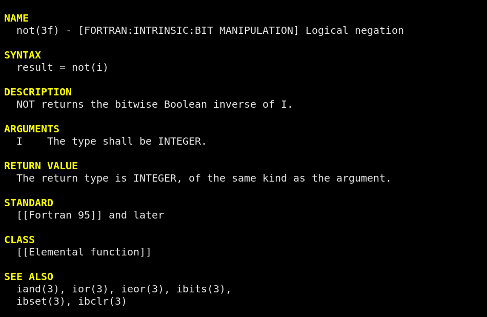

# fpm-man

[`fpm-man`](https://urbanjost.github.io/fpm-tools/fpm-man.1.html)
(Like `man`, but for Fortran man-pages) is a Fortran program that
displays descriptions of Fortran intrinsics.  It is platform-independent,
so it is particularly useful for command-line use on platforms without
manpages. `fpm-man` can

   + display a short description of each topic including category keys
   + display a description of any standard Fortran intrinsic 
   + allow capture of a small working example program for most topics
   + can search the TOC (Table of Contents) or all descriptions with regular expressions



To build it requires `git`, `gfortran`, and `fpm`(Fortran Package Manager).

```bash
   # ACCESSING

   # go to where you want to create the `fpm-man` directory and
   # get a clone of the repository
   git clone https://github.com/urbanjost/fpm-man.git
   # enter the repository directory
   cd fpm-man

   # BUILDING AND INSTALLING

   # (use `fpm help install` if do not want to install in the default
   # location)
   fpm install 

   # TRY IT

   # if you placed the program in a directory in your command path you
   # are ready to go!
   fpm-man --help
   fpm-man
   fpm-man -d sin
   fpm-man tan
   fpm-man --regex 'charact'
   fpm-man manual >book.txt
   fpm-man not -c |less -r  # if your terminal emulator supports ANSI color control sequences
```
### Using fpm-man(1) with vim(1)

From the vim(1) editor to extract just the demo program
into the current position use
```text
   :r! fpm-man -d date_and_time
```

### Using fpm-man(1) with vip(1) and bash(1)

The vip(1) script lets you use the vi(1) command with pipes.  See the
bash/ directory for a sample. On ULS platforms you can start up the editor
on the fpm-man(1) output. This is my favorite mode.

```bash
fpm-man tan|vip
```
Add this to your ~/.bashrc file
```bash
fm(){
(
export EDITOR='vim -c "set filetype=man"'
vip fpm-man $*
)
}
```
And you can now enter
```bash
fm tan
```
and be editing the man-page for tan(3f).

## REFERENCES

 + The fpm(1) home page is at [https://github.com/fortran-lang/fpm](https://github.com/fortran-lang/fpm).
   In includes instructions on **installing** from a binary or how to bootstrap from source.

 + For defining the man-page text, creating a CLI(command line inteface), allowing for regular
   expressions and common string functions and adding ANSI in-line color control sequences 
   it uses several `fpm` dependencies:
    + [M_intrinsics](https://github.com/urbanjost/M_intrinsics.git)
    + [M_CLI2](https://github.com/urbanjost/M_CLI2.git)
    + [M_match](https://github.com/urbanjost/M_match.git)
    + [M_strings](https://github.com/urbanjost/M_strings.git)
    + [M_escape](https://github.com/urbanjost/M_escape.git)
  + These scripts are useful in particular with `fpm-man`:
    + txt2man
    + vip.sh
